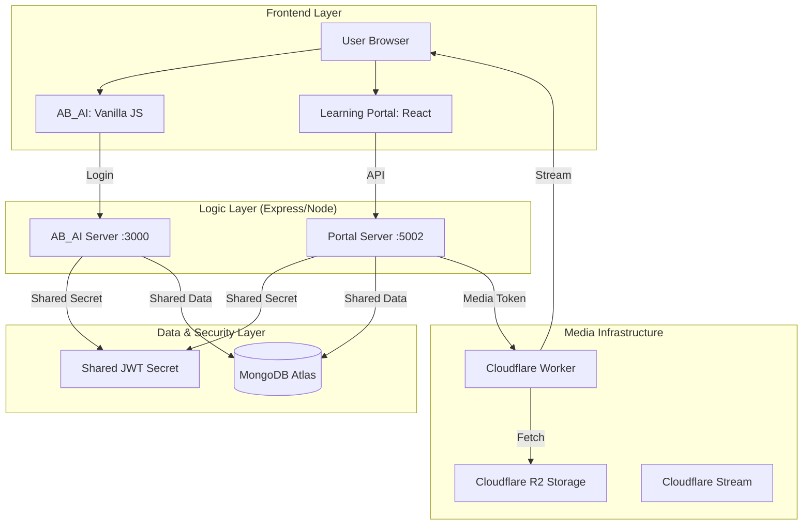

# Parashari Web Application System - Complete Technical Documentation

This document provides a comprehensive overview of the Parashari Institute platform, detailing its architecture, technology stack integration, and core functional flows.

---

## 1. System Philosophy & Architecture

The system is a **Integrated Monorepo** containing two distinct applications that share a common data layer and security infrastructure.

### The "Dual-Website" Strategy
1.  **AB_AI (The Marketing Hub)**:
    *   **Tech Stack**: Node.js/Express (Server) + Vanilla HTML/CSS/JS (Frontend).
    *   **Focus**: SEO optimization, fast landing page loads, and user acquisition (Auth entry).
2.  **Learning Portal (The LMS Application)**:
    *   **Tech Stack**: Node.js/Express (API) + React/Vite (Frontend).
    *   **Focus**: Interactive learning, state management, progress tracking, and secure content delivery.

### High-Level System Map


---

## 2. Core Technology Integration ("The Linking")

### A. MongoDB: The Shared Data Backbone
Both servers connect to the same **MongoDB Atlas Cluster**.
*   **Linking**: By using the same `MONGODB_URI` (or pointing to the same database name), accounts created in `AB_AI` are immediately available in the `learningPortal`.
*   **Collections**:
    *   `users`: Shared registry for authentication.
    *   `courses`: Shared metadata for display (Marketing) and enrollment (Portal).
    *   `enrollments`: Links `users` to `courses`, checked by both servers to gate access.

### B. Express & Node: The Logic Split
*   **AB_AI Server**: Handles "Public" logic (OTP generation, Account Creation, Landing Page SEO).
*   **Learning Portal Server**: Handles "Private" logic (Course Hierarchy, Progress Tracking, Media Signing).
*   **Linking**: Shared models and utility patterns ensure consistency.

### C. Cloudflare & R2: Secure Media Pipeline
The project uses the **"Broker Pattern"** to prevent unauthorized video downloads and link sharing.
1.  **Storage**: Videos are split into HLS chunks (`.m3u8` and Many `.ts` files) and stored in **Cloudflare R2**.
2.  **The Portal Server (The Broker)**:
    *   Generates a time-limited **HMAC-SHA256 Signature** using a `VIDEO_SIGNING_SECRET`.
    *   This signature encodes the user ID, course ID, and expiry timestamp.
3.  **Cloudflare Worker (The Gatekeeper)**:
    *   Located at `cloudflare-worker/video-signer.js`.
    *   Intercepts media requests.
    *   Validates the HMAC signature.
    *   **Dynamic Rewriting**: It parses the `.m3u8` playlist on the fly and appends the auth tokens to every `.ts` chunk link within the file.

---

## 3. Critical Functional Flows

### Flow 1: Authentication & Seamless Handoff
1.  **Login**: User logs in at `AB_AI/login.html`.
2.  **Token Generation**: `AB_AI` server validates credentials and signs a **JWT** using a `JWT_SECRET`.
3.  **Redirect**: The server redirects the user to `learningPortal/login?token=jwt_here`.
4.  **AutoLogin**: The React component `AutoLogin.jsx` extracts the token, saves it to `sessionStorage`, and redirects to `Dashboard.jsx`.
5.  **Validation**: Since BOTH servers share the same `JWT_SECRET`, the `learningPortal` server can verify the token without re-querying the `AB_AI` server.

### Flow 2: Secure Video Playback
1.  **Request**: User clicks "Play Video" in React.
2.  **Access Grant**: React calls `GET /api/video/access/:id`.
3.  **Security Check**: Server verifies user is enrolled and the video exists.
4.  **Signing**: Server generates a Signed URL pointing to the **Cloudflare Worker**.
5.  **Playback**: `HLSPlayer.jsx` (hls.js) loads the Signed URL. The Worker streams encrypted chunks from R2 only if the signature is valid.

---

## 4. Folder Structure & Responsibilities

```text
Parashari_webapp/
├── AB_AI/                          # Marketing Website (Node + Vanilla JS)
│   ├── server.js                   # Entry point (Port 3000)
│   ├── routes/                     # Auth, registration, and marketing APIs
│   ├── models/                     # Shared Mongoose Models (User, Course)
│   └── scripts/                    # Client-side form logic & UI
│
├── learningPortal/
│   ├── server/                     # LMS Backend (Node/Express API)
│   │   ├── server.js               # Entry point (Port 5002)
│   │   ├── routes/v2/              # High-performance hierarchical APIs
│   │   └── middleware/             # Role-based & Auth Gatekeepers
│   │
│   └── client/                     # LMS Frontend (React + Vite)
│       ├── src/pages/              # Dashboard, CoursePlayer, Catalog
│       └── src/components/         # HLSPlayer, Sidebar, ProtectedRoutes
│
├── cloudflare-worker/              # Media Security Layer
│   └── video-signer.js             # Edge logic for R2 content protection
│
└── package.json                    # Root manifest
```

---

## 5. Maintenance & Safety Rules

> [!IMPORTANT]
> **JWT Sync**: If you change `JWT_SECRET` in `AB_AI`, you **MUST** update it in `learningPortal/server` or logins will fail.

> [!WARNING]
> **Worker Deployment**: Never modify `video-signer.js` without local testing, as it can block media access for all students instantly.

> [!TIP]
> **Database Sync**: If adding a field to the `User` model, update it in BOTH `AB_AI/models/User.js` and `learningPortal/server/models/User.js` to avoid schema mismatches.
